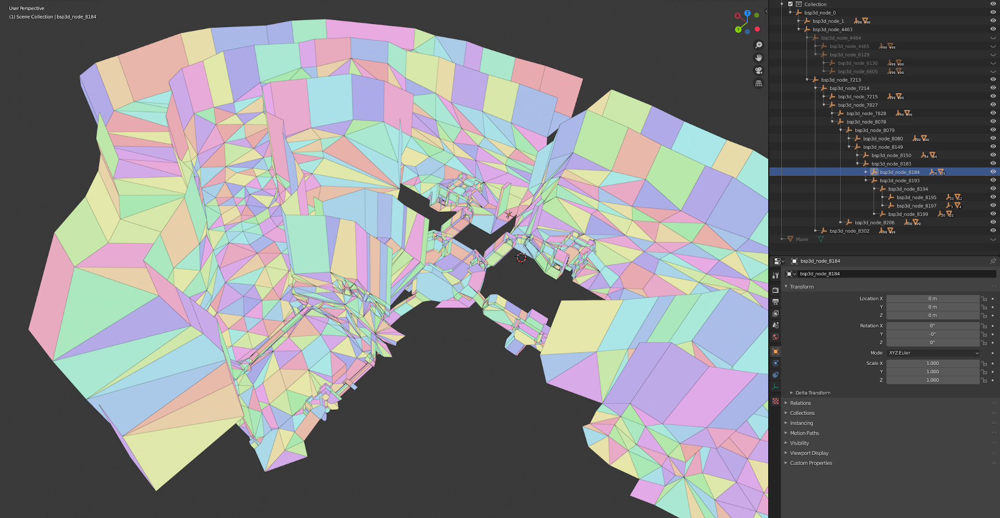

# Halo BSP experiments
This repo contains a few scripts used to experiment with and visualize Halo's `scenario_structure_bsp` tag structure with the goal of reverse engineering game behaviour, documenting field purposes, and trying to solve the longstanding phantom BSP problem.

## port_lm.py
Attempts to transplant a lightmap from an earlier version of a BSP to a similar new one without having to rebake lighting. Minor BSP changes to correct portals or phantom collision may unpredictably change how render mesh surfaces are unwrapped and packed to lightmap pages, so this script repacks all lightmap pages into a single uberlightmap and builds UV coordinate transforms, mapping all lightmap UVs in the target BSP to a transformed version of the source BSP's UVs. Vertex matching is done by proximity, texture UV, and normal similarity, since the ordering of vertices will be unpredictable.

This script sort of works!

## insanity.py
Translates the entire BSP and player spawns by any offset. Allows the BSP to be moved to extremely distant locations where 32-bit float precision shows its limits. The game has a limit of 5000 world units in any direction.

## spiderman.py
Makes all surfaces climbable like a ladder.

## fix-phantom.py
Attempt to create a generic tool to find and fix phantom BSP in a collision mesh.

## phantom-testing.py
Includes various attempts (with 2 successful) to fix the phantom BSP found in Danger Canyon's central ramps area.

## bsp-to-collada.py
Can be used (with some path edits) to convert a BSP tag's collision BSP tree to Collada format. The tree structure is retained with 2D BSPs and surfaces at the leaves, along with node planes when they are defined by level surfaces. The collada file can then be imported into Blender for troubleshooting:

## Future work
* Understand why phantom BSP test `fix_b` didn't work.
* The map Derelict contains a collision "hole" which items can fall through but not players. Investigate this to see if there's a similar fix.
